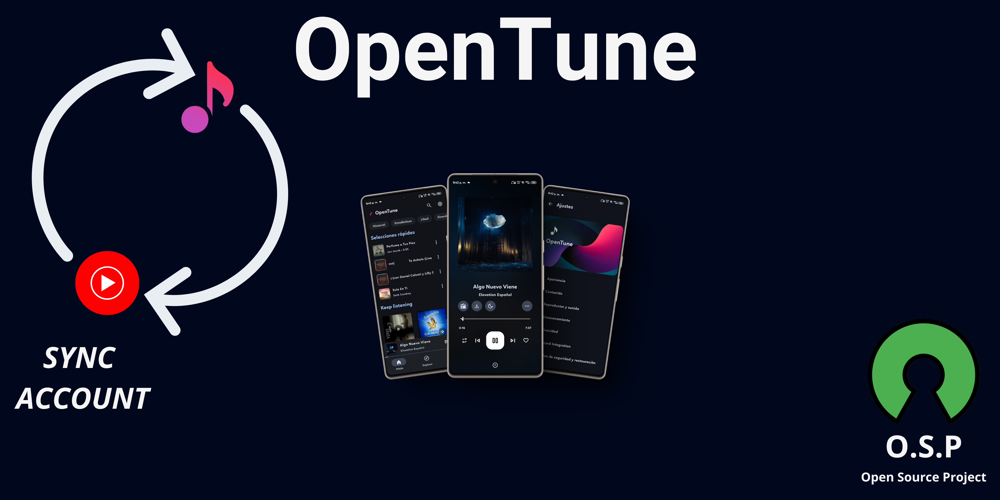
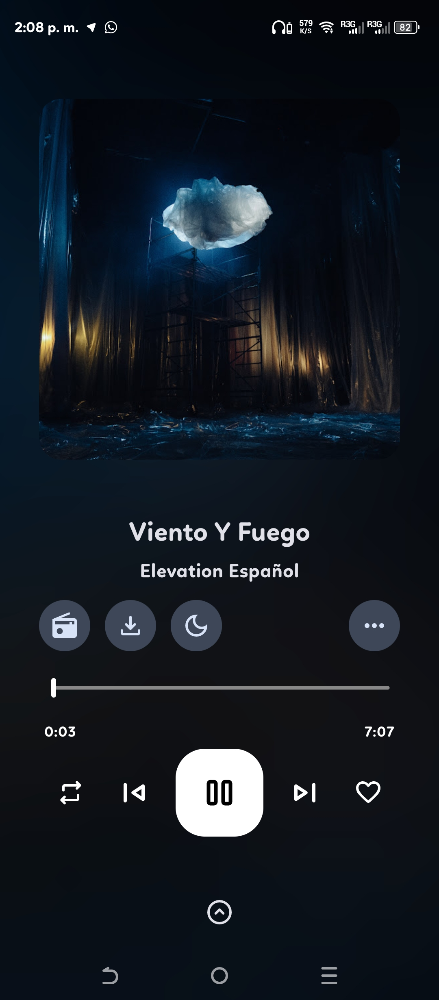
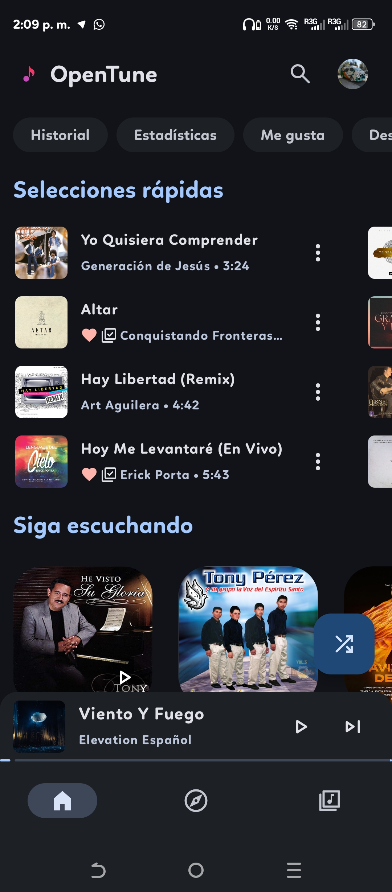
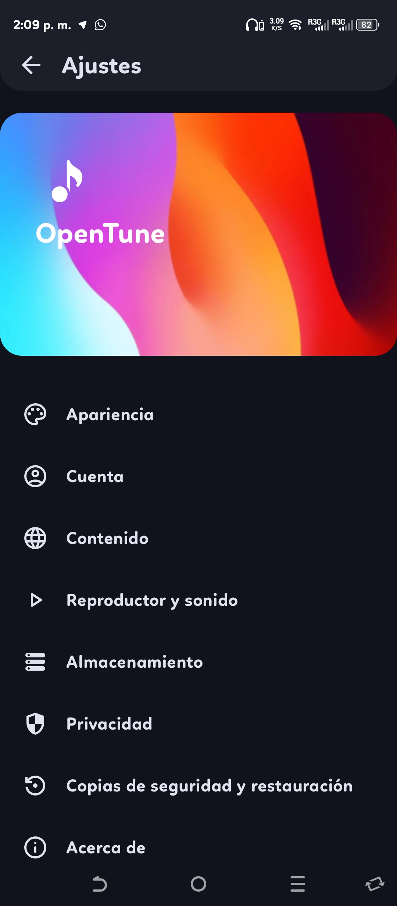
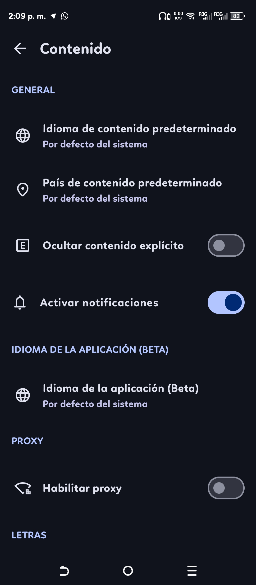
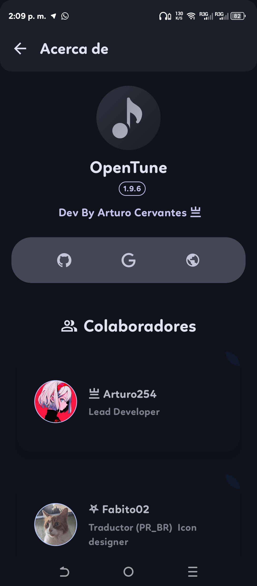
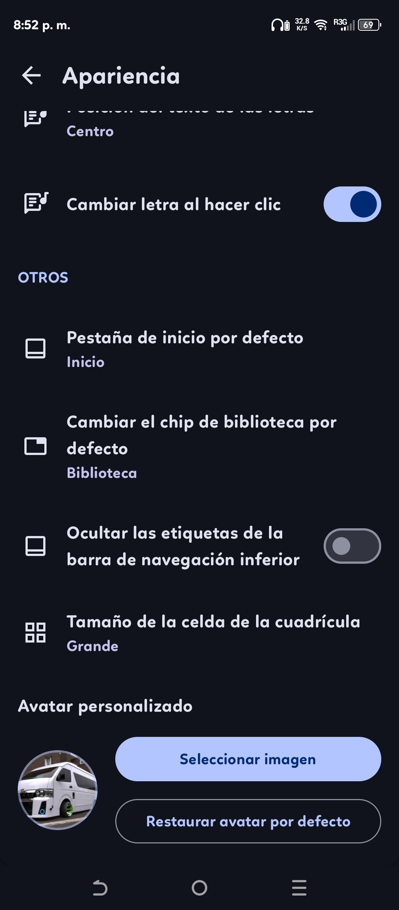

  

<h1 align="center">OpenTune</h1>

  
  
  
  
  

  <strong>An advanced YouTube Music client for Android built with Material Design 3.</strong>
   
  Enjoy your favorite music without interruptions, with premium features and a modern interface.

  <a href="README.en.md">English</a> •
  <a href="README.md">Español</a>

---

## 📸 Screenshots

  
  
  

  
  
  

---

## ✨ Key Features

### 🎵 Playback Experience
- **Ad-Free**: Smooth playback without any advertising interruptions.
- **Background Playback**: Keep listening while using other apps or with the screen off.
- **Smart Silence Skip**: Automatically skip segments without audio in tracks.
- **Volume Normalization**: Maintain a consistent sound level between different songs.
- **Speed & Pitch Control**: Adjust playback to your preferences.

### 🎨 Design & Personalization
- **Material Design 3**: Clean and modern interface based on Google's latest design guidelines.
- **Dynamic Theming**: The app colors adapt to the album artwork (Material You).
- **Synchronized Lyrics**: Sing along with real-time lyrics.
- **Artwork Export**: Save high-resolution album covers.

### 📂 Management & Connectivity
- **Downloads**: Save music and playlists for offline listening.
- **Account Integration**: Sign in to sync your preferences, playlists, and library.
- **Android Auto**: Enjoy your music safely while driving.
- **Multi-language Support**: Available in numerous languages thanks to the community.

---

## 🚀 Installation

<b>View System Requirements</b>

| Component | Minimum Requirement |
|:----------|:--------------------|
| Operating System | Android 6.0 (Marshmallow) or higher |
| Storage Space | 10 MB available |
| RAM | 2 GB recommended |

### Installation Methods

1. **GitHub Releases (Recommended)**:
   - Go to the [Releases](https://github.com/Arturo254/OpenTune/releases) section.
   - Download the APK for the latest stable version.
   - Install it on your device.
2. **Official Website**: Visit [opentune.netlify.app](https://opentune.netlify.app/).
3. **F-Droid / OpenApk**: Also available on alternative open-source stores.

---

## 🛠️ Technology Stack

| Frontend | Development Tools |
|:--------:|:-----------------:|
|  |  |
|  |  |
|  |  |

---

<b>🛠️ Building from Source</b>

### Prerequisites
- **Android Studio Giraffe** or higher.
- **JDK 11** or higher.
- **Gradle 7.5** or higher.

### Steps
1. Clone the repository: `git clone https://github.com/Arturo254/OpenTune.git`
2. Open the project in Android Studio.
3. Wait for Gradle synchronization to finish.
4. Run `Build > Build APK(s)`.

---

## 🤝 Contribution & Community

Contributions are what make the open-source community such an amazing place!

- **Documentation**: Check our [Wiki/GitBook](https://opentune.gitbook.io/).
- **Translations**: Help us on [Crowdin](https://crowdin.com/project/opentune).
- **Telegram Channels**:
  - [Community Chat](https://t.me/OpenTune_chat)
  - [Updates Channel](https://t.me/opentune_updates)

---

## ❤️ Acknowledgments

- **mostafaalagamy** for the MetroList implementation.
- **Fabito02** for the unconditional support.
- All community translators and beta testers.

---

## 📜 License

This project is licensed under **GPL-3.0**. See the [LICENSE](LICENSE) file for more details.

> **Note**: OpenTune is an independent project and is not affiliated with, sponsored, or endorsed by YouTube or Google.

---

  Developed with ❤️ by <a href="https://github.com/Arturo254">Arturo Cervantes</a>

  
  

